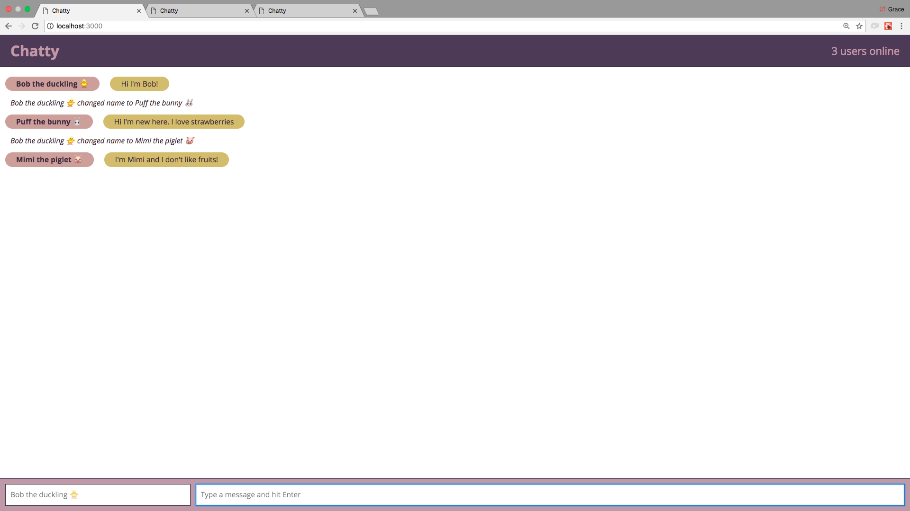

Chatty App
=====================

ChatRoom styled as a Single Page App.
Multiple users can chat at one place. 
Default user is set as Bob the duckling 🐥 if users don't feel like giving a name.

### Screen Shots

### Dependencies

* special guest - 🦄 acting as react-root to support magic throughout the app
* React
* Webpack
* Express Server
* WebSockets
* UUID
* [babel-loader](https://github.com/babel/babel-loader)
* [webpack-dev-server](https://github.com/webpack/webpack-dev-server)
